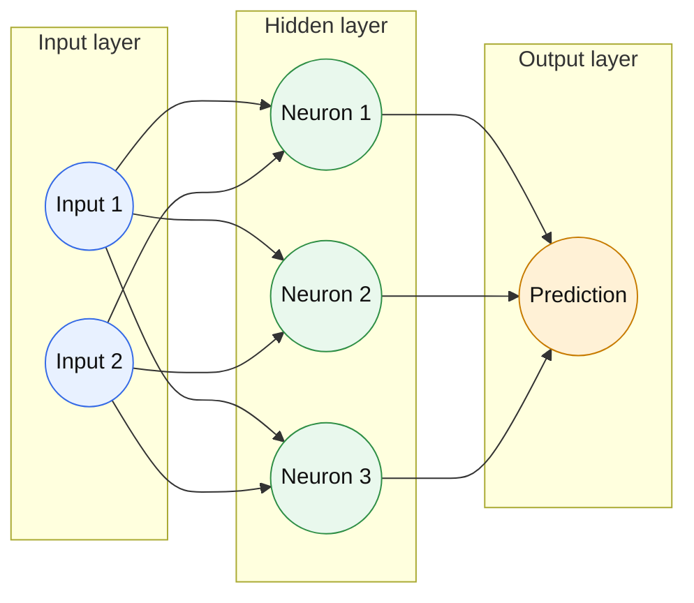
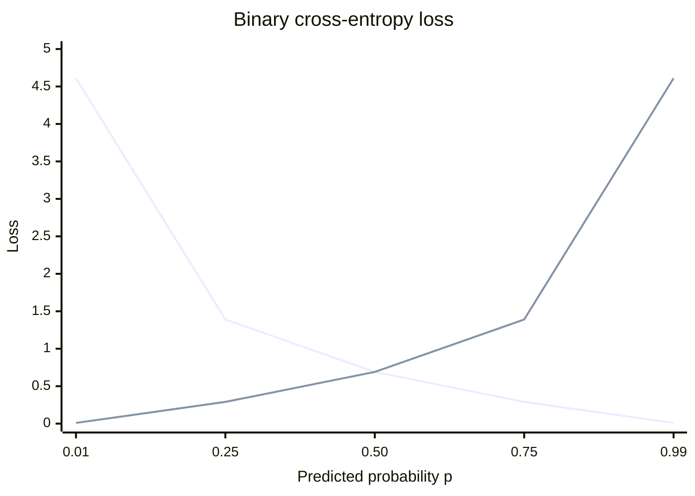
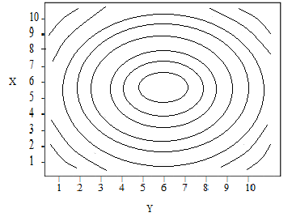

# Neural Networks From Scratch

This repository contains feed-forward neural network implemented from scratch and a notebook that applies it to the Parkinson's disease dataset. The sections below explain the theory underlying the feed-forward neural network implementation in [`neural_network.py`](neural_network.py).

## 1. The neuron

A **neuron** is the basic computational unit of a neural network. It consists of weights, a bias, and an activation function. For one neuron with weights $w_1,\ldots,w_n$, bias $b$, and activation function $\sigma$, the following computation is applied to input values $a_1,\ldots,a_n$ to return an output $a$:

$$
z = \sum_{k=1}^{n} w_k a_k + b,
\qquad
a = \sigma(z).
$$

Typically, a sigmoid equation is used for the activation function $\sigma$:

$$
\sigma(z) = \frac{1}{1 + e^{-z}}.
$$

For a numerical example, use these input and weight vectors:

$$
\mathbf{a} =
\begin{bmatrix}0.5 \\ -1.0\end{bmatrix},
\qquad
\mathbf{w} =
\begin{bmatrix}0.4 \\ -0.6\end{bmatrix},
\qquad
b = 0.2.
$$

The neuron takes their dot product, adds the scalar bias, and applies the activation function:

$$
z = \mathbf{w}^{T}\mathbf{a} + b
=
\begin{bmatrix}0.4 & -0.6\end{bmatrix}
\begin{bmatrix}0.5 \\ -1.0\end{bmatrix}
+ 0.2
= 1.0,
\qquad
a = \sigma(z).
$$

For this example, $z=1.0$, so:

$$
a = \sigma(1.0)
= \frac{1}{1 + e^{-1.0}}
\approx 0.7311.
$$

In code, the input and weight vectors are one-dimensional NumPy arrays. A layer applies this same vector operation to many neurons at once using a matrix of weight vectors.

~~~python
activation = np.array([0.5, -1.0])
weights = np.array([0.4, -0.6])
bias = 0.2

preactivation = weights @ activation + bias  # 1.0
output = sigmoid(np.array([preactivation]))  # [0.7311]
~~~

## 2. The neural network

A neural network contains many layers: the input layer, hidden layers, and output layer. Section 1 described one neuron as a weight vector, a bias, and an activation function. A layer groups many such neurons together.

*Each circle represents a neuron. The arrows show information flowing from the input layer, through the hidden layer, to the output layer. The matrix representation below shows how the neurons in one layer are represented together.*

Suppose a layer has $q$ neurons and receives the activation vector $\mathbf{a}^{(l-1)}$ as input values. Each neuron has its own weight vector. We represent the layer by stacking those weight vectors as the rows of one matrix:

$$
\Theta^{(l)} =
\begin{bmatrix}
\mathbf{w}^{(l)}_1{}^T \\
\mathbf{w}^{(l)}_2{}^T \\
\vdots \\
\mathbf{w}^{(l)}_q{}^T
\end{bmatrix},
\qquad
\mathbf{z}^{(l)} = \Theta^{(l)}\mathbf{a}^{(l-1)}.
$$

The first row of $\Theta^{(l)}$ represents the first neuron, the second row represents the second neuron, and so on. The matrix product collects the preactivation produced by each neuron into the vector $\mathbf{z}^{(l)}$.

### Running numerical example

Start with a hidden layer containing two neurons. Its weight matrix has one row for each neuron:

$$
\Theta^{(1)} =
\begin{bmatrix}
0.2 & 0.4 & -0.6 \\
-0.5 & 0.8 & 0.3
\end{bmatrix}.
$$

The first row contains the weights for the first hidden neuron, and the second row contains the weights for the second hidden neuron. Now introduce one two-feature input instance:

$$
\mathbf{x} = \begin{bmatrix}0.5 \\ -1.0\end{bmatrix}.
$$

Before entering the hidden layer, prepend the bias activation $1$ to obtain:

$$
\mathbf{a}^{(0)} = \begin{bmatrix}1 \\ 0.5 \\ -1.0\end{bmatrix}.
$$

Multiplying the hidden matrix by this activation vector computes both neurons' preactivations in one operation:

$$
\mathbf{z}^{(1)} = \Theta^{(1)}\mathbf{a}^{(0)}
=
\begin{bmatrix}
0.2 & 0.4 & -0.6 \\
-0.5 & 0.8 & 0.3
\end{bmatrix}
\begin{bmatrix}1 \\ 0.5 \\ -1.0\end{bmatrix}
=
\begin{bmatrix}1.0 \\ -0.4\end{bmatrix}.
$$

The first row produces the first neuron's preactivation, and the second row produces the second neuron's preactivation. Applying sigmoid element by element gives:

$$
\sigma(\mathbf{z}^{(1)})
\approx
\begin{bmatrix}0.7311 \\ 0.4013\end{bmatrix}.
$$

The hidden layer's output, with a new bias entry prepended, now becomes the input to the output neuron:

$$
\mathbf{a}^{(1)} \approx
\begin{bmatrix}1 \\ 0.7311 \\ 0.4013\end{bmatrix},
\qquad
\Theta^{(2)} = \begin{bmatrix}0.1 & 0.7 & -0.2\end{bmatrix}.
$$

In code, these same vectors and matrices are:

~~~python
x = np.array([0.5, -1.0])
a0 = prepend_bias_term(x)  # [1.0, 0.5, -1.0]

theta_hidden = np.array([
    [0.2, 0.4, -0.6],
    [-0.5, 0.8, 0.3],
])
z1 = theta_hidden @ a0                         # [1.0, -0.4]
a1 = prepend_bias_term(sigmoid(z1))            # [1.0, 0.7311, 0.4013]

theta_output = np.array([[0.1, 0.7, -0.2]])
z2 = theta_output @ a1                          # [0.5315]
p = sigmoid(z2)                                 # [0.6298]

print('z1 =', z1)
print('a1 =', a1)
print('p =', p)
~~~

## 3. Forward propagation: inputs become outputs

As described in Section 2, forward propagation applies multiple layers to the input values. Each layer receives the output values from the previous layer and produces its own output values, which become the input to the next layer. The output layer produces the final output values, or predictions. For binary classification, the final output $p$ is interpreted as the predicted probability that $y=1$; the class prediction is $1$ when $p > 0.5$, and $0$ otherwise.

For a three-layer network, the weight matrices could be:

$$
\Theta^{(1)} =
\begin{bmatrix}
0.2 & 0.4 & -0.6 \\
-0.5 & 0.8 & 0.3
\end{bmatrix},
\qquad
\Theta^{(2)} =
\begin{bmatrix}
0.1 & 0.7 & -0.2 \\
0.4 & -0.3 & 0.6
\end{bmatrix},
\qquad
\Theta^{(3)} =
\begin{bmatrix}
-0.2 & 0.5 & 0.8
\end{bmatrix}.
$$

Using $\mathbf{a}^{(0)} = [1, 0.5, -1]^T$ and applying sigmoid after each layer:

$$
\mathbf{z}^{(1)} = \Theta^{(1)}\mathbf{a}^{(0)}
= \begin{bmatrix}1.0 \\ -0.4\end{bmatrix},
\qquad
\mathbf{a}^{(1)} = \begin{bmatrix}1 \\ 0.7311 \\ 0.4013\end{bmatrix},
$$

$$
\mathbf{z}^{(2)} = \Theta^{(2)}\mathbf{a}^{(1)}
\approx \begin{bmatrix}0.5315 \\ 0.4215\end{bmatrix},
\qquad
\mathbf{a}^{(2)} \approx \begin{bmatrix}1 \\ 0.6298 \\ 0.6038\end{bmatrix},
$$

$$
z^{(3)} = \Theta^{(3)}\mathbf{a}^{(2)} \approx 0.5980,
\qquad
p = \sigma(z^{(3)}) \approx 0.6452.
$$

Therefore, the final output is $p \approx 0.6452$, which represents a 64.52% predicted probability of class 1. Using a threshold of 0.5, the predicted class is 1.

## 4. Loss: comparing predictions with actual values

The network learns by comparing its prediction with the known target. For binary classification, the implementation uses binary cross-entropy:

$$
\mathcal{L}(p,y)
= -\left[y\log(p) + (1-y)\log(1-p)\right],
$$

where $y\in\{0,1\}$ is the actual class and $p\in(0,1)$ is the predicted probability. A confident correct prediction has low loss; a confident incorrect prediction has high loss.

Using the running example's prediction $p=0.6452$, if the actual class is $y=1$:

$$
\mathcal{L}(0.6452,1)
= -\left[1\log(0.6452) + 0\log(1-0.6452)\right]
\approx 0.4382.
$$

If the actual class is instead $y=0$, the same prediction receives a larger loss:

$$
\mathcal{L}(0.6452,0)
= -\left[0\log(0.6452) + 1\log(1-0.6452)\right]
\approx 1.0362.
$$

The curves below show why log loss is useful. It gives a small penalty to confident correct predictions, but a rapidly increasing penalty to confident incorrect predictions:

~~~python
def compute_cost(y_pred: np.ndarray, y_true: np.ndarray) -> float:
    # y_pred is p and y_true is y in the binary cross-entropy equation.
    cost = -np.sum(
        y_true * np.log(y_pred)
        + (1 - y_true) * np.log(1 - y_pred)
    )
    return cost
~~~

## 5. Regularizing and averaging cost

For a batch $\mathcal{B}$ containing $m$ instances, the data loss is averaged:

$$
J_{\text{data}} = \frac{1}{m}\sum_{i\in\mathcal{B}} \mathcal{L}(p_i,y_i).
$$

The implementation can add L2 regularization to discourage large non-bias weights:

$$
J = J_{\text{data}}
+ \frac{\lambda}{2m}\sum_l\sum_{j,k>0}
\left(\Theta^{(l)}_{jk}\right)^2.
$$

The condition $k>0$ excludes the first, bias-weight column.

For a non-bias weight $\theta$, the penalty is proportional to $\theta^2$. When $\theta=0$, both the penalty and its regularization gradient are zero, and that connection contributes nothing to the neuron's weighted sum. Penalizing large weights encourages simpler models and helps reduce overfitting.

~~~python
def regularize_and_average_cost(thetas, total_cost, regularization_strength, num_instances):
    # theta[:, 1:] excludes each layer's bias-weight column.
    regularization = (regularization_strength / (2 * num_instances)) * (
        sum(np.sum(theta[:, 1:] ** 2) for theta in thetas)
    )

    # Combine the average data loss with the L2 penalty.
    return total_cost / num_instances + regularization
~~~

## 6. Backpropagation: computing the error signals

Backpropagation computes the derivative of the loss with respect to every layer's preactivation. Define the delta for layer $l$ as:

$$
\boldsymbol{\delta}^{(l)}
= \frac{\partial \mathcal{L}}{\partial \mathbf{z}^{(l)}}.
$$

For binary cross-entropy with sigmoid activation, the two component derivatives are:

$$
\frac{\partial \mathcal{L}}{\partial a}
= -\frac{y}{a} + \frac{1-y}{1-a},
\qquad
\frac{\partial a}{\partial z}
= a(1-a).
$$

Applying the chain rule, multiplying these two derivatives gives:

$$
\frac{\partial \mathcal{L}}{\partial z}
=
\frac{\partial \mathcal{L}}{\partial a}
\frac{\partial a}{\partial z}
= p-y.
$$

### Output layer

As shown above, for a sigmoid output layer with binary cross-entropy, the output delta is:

$$
\boldsymbol{\delta}^{(L)}
= \frac{\partial \mathcal{L}}{\partial z^{(L)}}
= \mathbf{p} - \mathbf{y}.
$$

### Hidden layers

For a hidden layer, the chain rule gives:

$$
\boldsymbol{\delta}^{(l)}
= \frac{\partial \mathcal{L}}{\partial \mathbf{z}^{(l)}}
= \left((\Theta^{(l+1)})^T
\boldsymbol{\delta}^{(l+1)}\right)
\odot \sigma'\left(\mathbf{z}^{(l)}\right),
$$

and the sigmoid derivative is:

$$
\sigma'(z)
= \frac{\partial a}{\partial z}
= \sigma(z)(1-\sigma(z)).
$$

The code applies this equation from the output layer backward. `delta_current[1:]` removes the bias position because bias activations are not neurons that need a previous-layer error signal.

| Derivative | Meaning |
| --- | --- |
| $\frac{\partial \mathcal{L}}{\partial a}$ | How the loss changes when an activation changes. |
| $\frac{\partial a}{\partial z}$ | How the activation changes when the preactivation changes. |
| $\frac{\partial \mathcal{L}}{\partial z}$ | How the loss changes when the preactivation changes, combining both effects through the chain rule. |

~~~python
def compute_deltas(thetas, y_pred, y_true, layers_activations):
    # Output-layer equation above:
    # delta^(L) = dL/dz^(L) = p - y.
    output_layer_delta = y_pred - y_true
    deltas = [output_layer_delta]

    # Move backward through hidden layers using:
    # delta^(l) = ((Theta^(l+1)).T @ delta^(l+1)) * sigma'(z^(l)).
    for theta_next, activation_current in zip(
        reversed(thetas[1:]), reversed(layers_activations[1:-1])
    ):
        # Propagate the next layer's error through its transpose weights.
        delta_next = deltas[0]

        # Apply the hidden-layer chain rule from the subsection above.
        # activation_current * (1 - activation_current) is sigma'(z^(l)).
        delta_current = (
            (theta_next.T @ delta_next)
            * activation_current
            * (1 - activation_current)
        )

        # Remove the bias entry: biases are not previous-layer neurons.
        delta_current = delta_current[1:]
        deltas.insert(0, delta_current)

    return deltas
~~~

## 7. Gradients: how deltas become weight derivatives

The loss can be viewed as a surface over the model's weights. The closed curves below are contours: every point on one curve has the same loss. At the current weights, the gradient points toward the steepest increase in loss, so the gradient-descent update moves in the opposite direction toward lower-loss contours.

For a weight connecting activation $a_k^{(l-1)}$ to neuron $j$ in layer $l$, the chain rule gives:

$$
\frac{\partial J}{\partial \Theta^{(l)}_{jk}}
= \delta^{(l)}_j a^{(l-1)}_k.
$$

For the whole layer, these individual derivatives form a gradient matrix. Because each entry is a product of one delta and one incoming activation, the matrix is an outer product:

$$
\nabla_{\Theta^{(l)}}J
= \boldsymbol{\delta}^{(l)}
\left(\mathbf{a}^{(l-1)}\right)^T.
$$

This gradient describes how much the loss changes when that particular weight changes slightly.

| Quantity | Meaning |
| --- | --- |
| $\frac{\partial J}{\partial \Theta^{(l)}_{jk}}$ | The derivative of the loss with respect to one particular weight. It measures how the loss changes when that weight changes slightly, while the other weights remain fixed. |
| $\nabla_{\Theta^{(l)}}J$ | The gradient of the loss with respect to all weights in layer $l$, represented as a matrix of derivatives. Viewed as a vector in parameter space, it points in the direction of steepest increase in loss; gradient descent moves in the opposite direction. |

The implementation uses `np.outer` to create exactly that matrix:

~~~python
def compute_gradients(activations, deltas):
    gradients = []

    # activations[:-1] supplies a^(l-1); deltas supplies delta^(l).
    for delta_next, activation_current in zip(deltas, activations[:-1]):
        # Each entry is delta_j * activation_k.
        gradient_current = np.outer(delta_next, activation_current)
        gradients.append(gradient_current)

    return gradients
~~~

For a batch, the per-instance gradients are summed and then divided by the batch size. The regularization gradient $\lambda\Theta/m$ is added to non-bias weights before the update.

## 8. Good news: PyTorch can automate the update

In practice, libraries such as PyTorch provide loss functions and automatic differentiation to compute the loss and gradients. The manual equations here are mainly useful for understanding what those tools calculate.

PyTorch can calculate the gradients and update the weights for us. After the loss is computed, `loss.backward()` calculates the gradients and `optimizer.step()` applies the gradient-descent update:

~~~python
optimizer.zero_grad()  # Clear gradients from the previous batch.
predictions = model(x_batch)
loss = loss_function(predictions, y_batch)
loss.backward()        # Compute gradients automatically.
optimizer.step()       # Update every weight automatically.
~~~

The manual equations explain what these functions are calculating; PyTorch performs the repetitive derivative and weight-update operations.

## 9. Weight updates: gradient descent

Once the gradient is known, gradient descent changes every parameter according to:

$$
\Theta^{(l)}_{\text{new}}
= \Theta^{(l)}_{\text{old}}
- \eta\nabla_{\Theta^{(l)}}J,
$$

where $\eta$ is the step size, or learning rate. The minus sign moves the parameters opposite to the direction in which the loss increases.

This uses the gradient interpretation from [Section 7](#7-gradients-how-deltas-become-weight-derivatives): the gradient points toward the steepest increase in loss, so subtracting it moves the weights toward lower loss.

~~~python
def _update_weights(self, gradients, step_size):
    updated_thetas = []

    for theta, gradient in zip(self.thetas, gradients):
        # Move each weight opposite its loss gradient.
        updated_theta = theta - step_size * gradient
        updated_thetas.append(updated_theta)

    # The new matrices become the parameters used by the next batch.
    self.thetas = updated_thetas
~~~

## 10. Instances, batches, epochs, and updates

- An **instance** is one feature vector and its target $(\mathbf{x}_i,y_i)$.
- A **batch** is a group of instances processed before one update.
- After each batch, the weights are updated once.
- An **epoch** is one complete pass through all training instances.
- A **weight update** changes every weight matrix once.

If there are $N$ training instances and the batch size is $B$, one epoch contains:

$$
\text{updates per epoch} = \left\lceil\frac{N}{B}\right\rceil.
$$

For the demonstration, $N=156$ and $B=32$, so there are **5 weight updates per epoch**: $\lceil156/32\rceil=5$, consisting of four batches of 32 and one final batch of 28. Because weights are updated after each batch, each of these five batches produces one weight update. One instance contributes a gradient; the batch combines those gradients; the update changes the weights; the next epoch repeats the process with the changed weights.

~~~python
for iteration in range(num_iterations):       # One iteration is one epoch.
    batches = create_batches(X_train, y_train, batch_size, ...)

    for X_batch, y_batch in batches:            # One weight update per batch.
        gradient_totals = [np.zeros_like(theta) for theta in self.thetas]

        for x_i, y_i in zip(X_batch, y_batch):  # Process each instance.
            _, activations, y_pred_i = self._forward_propagate(x_i)
            deltas = compute_deltas(self.thetas, y_pred_i, y_i, activations)
            gradients = compute_gradients(activations, deltas)
            gradient_totals = accumulate_gradients(gradient_totals, gradients)

        # Average the batch's gradients, then update all weight matrices once.
        final_gradients = regularize_and_average_gradients(
            self.thetas,
            gradient_totals,
            self.regularization_strength,
            len(X_batch),
        )
        self._update_weights(final_gradients, self.step_size)
~~~

Shuffling changes which instances share a batch, but not the number of instances processed per epoch. Increasing the batch size usually means fewer updates per epoch; increasing the number of epochs means more complete passes over the same training data.

## Project layout

~~~text
neural_network.py          neural-network implementation
parkinsons_demo.ipynb      training and evaluation demonstration
data/                      fixed Parkinson's train/test split
~~~

## Setup

~~~bash
python -m pip install -r requirements.txt
~~~

Open [`parkinsons_demo.ipynb`](parkinsons_demo.ipynb) and run all cells. The notebook standardizes features using training data only, trains the network, and reports test accuracy and F1 score.
